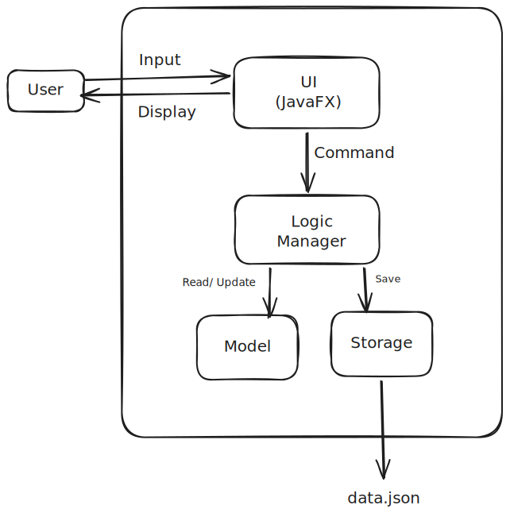
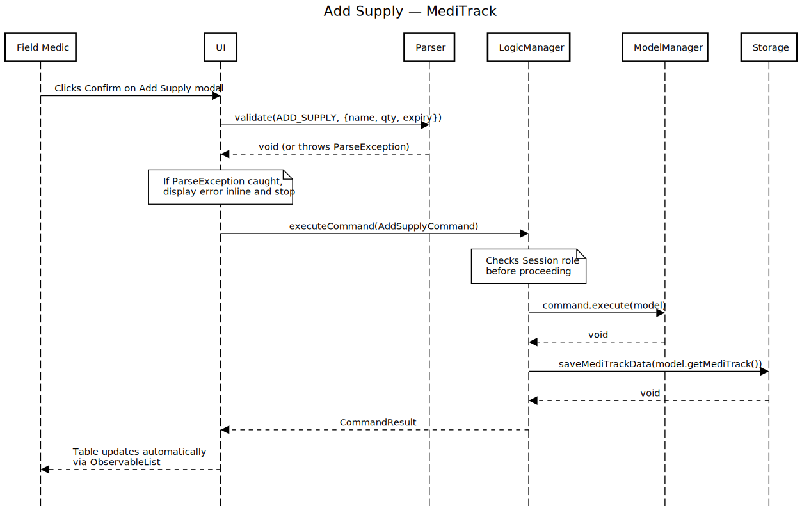

# MediTrack: Software Design Document

---

## 1. System Overview

MediTrack is a standalone JavaFX desktop application built to help military field units manage medical supply inventories and track the medical readiness of their personnel, all in one place, with no internet required.

The application supports three user roles: Field Medic, Medical Officer / Platoon Commander, and Logistics Officer. Each role gets a different view of the system after logging in, so users only see what's relevant to them. Everything is stored locally in a JSON file, meaning the app works completely offline with no external dependencies.

### 1.1 Design Goals

- Role-based access so each user type only sees what they need. This means no clutter and no unauthorised actions.
- A clean separation between the UI, business logic, data model, and storage. This means each layer does one job.
- Fully offline operation, since field environments can't always guarantee internet access.
- Input validation at every entry point, because bad data in means bad data out.

---

## 2. Architecture Design

MediTrack uses a layered architecture split into four layers: UI, Logic, Model, and Storage. Each layer only talks to the one directly next to it, which makes the system easier to reason about and test independently.

### 2.1 Layer Responsibilities

| Layer   | Responsibility |
|---------|----------------|
| UI      | Renders the interface, captures user actions, displays results |
| Logic   | Receives commands from the UI, delegates to Parser, executes against Model |
| Model   | Holds the in-memory state of all Supply and Personnel records |
| Storage | Reads from and writes to `data.json` on startup and after every command |

### 2.2 Authentication Layer

There's a lightweight authentication layer that runs before the main UI loads. On first launch, if `data.json` doesn't exist yet, the app prompts the user to create a password. On every subsequent launch, a login screen asks for the password and role before anything else is shown. The active session — role only, no password — is held in memory and wiped when the app closes.

### 2.3 Parser Role in a GUI Context

The Parser's job is purely **validation**. It checks that the values collected from a form are valid before the UI constructs a Command. If something's wrong, it throws a `ParseException` and the UI shows the error message inline.

---

## 3. Major System Components

### 3.1 UI Component

Built entirely in JavaFX. The UI talks to Logic through a single method: `Logic.executeCommand(Command)'. It never touches Model or Storage directly.

**Pre-login screens**
- First Launch Setup: shown once when no `data.json` exists and lets the user set a password
- Login Screen: password field, role dropdown, login button

**Field Medic screens**
- Inventory: full supply table with add, edit, and delete actions
- Expiring Soon: automatically filtered view of supplies expiring within 30 days
- Personnel: read-only personnel table for situational awareness

**Medical Officer / Platoon Commander screens**
- Personnel: full personnel table with add, remove, and inline status update
- FIT Personnel: filtered view of FIT personnel with a live headcount
- Duty Roster: generates a randomised roster from FIT personnel, can be regenerated

**Logistics Officer screens**
- Supply Levels: read-only view of the full inventory
- Resupply Report: auto-generated report flagging low stock and items nearing expiry

**Shared modal dialogs**
- Add Supply, Edit Supply, Delete Supply (with confirmation)
- Add Personnel, Remove Personnel (with confirmation)

### 3.2 Logic Component

This is the execution engine of the app. It receives Command objects from the UI, checks the current session role, runs the command against the Model, and saves the result via Storage.

Key classes:
- `LogicManager`: the central coordinator, implements the `Logic` interface
- `Command` (abstract): base class for all commands
- Concrete commands: `AddSupplyCommand`, `EditSupplyCommand`, `DeleteSupplyCommand`, `AddPersonnelCommand`, `RemovePersonnelCommand`, `UpdateStatusCommand`, `GenerateRosterCommand`, `GenerateResupplyReportCommand`

Role enforcement happens inside `LogicManager.executeCommand()` before any command actually runs. If the current role doesn't have permission, a `CommandException` is thrown and the UI shows it as an error result.

### 3.3 Parser Component

The Parser is a validation-only utility. The UI calls it after the user hits Confirm on any form, before building the Command object. It checks each field against the rules for that command type and throws a `ParseException` with a clear message if anything fails.

Key classes:
- `Parser`: exposes `validate(CommandType, Map<String, String>)`
- `CommandType`: enum covering all supported command types
- `ParseException`: thrown with a descriptive message on validation failure

Validation rules by command:

| Command | Rules enforced |
|---------|----------------|
| ADD_SUPPLY / EDIT_SUPPLY | Name is non-empty, quantity > 0, expiry date is valid and in the future, no duplicate name on add |
| DELETE_SUPPLY / REMOVE_PERSONNEL | Index is a positive integer within the current list bounds |
| ADD_PERSONNEL | Name is non-empty, status is a valid `Status` enum value |
| UPDATE_STATUS | Status must be one of: `FIT`, `LIGHT_DUTIES`, `UNFIT` |
| GENERATE_ROSTER | At least one FIT personnel record must exist |
| GENERATE_RESUPPLY_REPORT | At least one supply record must exist |

### 3.4 Model Component

The Model component is responsible for holding the application's in-memory state. It exposes `ObservableList`s so that JavaFX can automatically update the UI whenever the underlying data changes, and provides filter and query methods used by the report screens.

Key classes:
- `ModelManager`: the concrete implementation of the `Model` interface that acts as the central point of access for all data operations
- `MediTrack`: the root data container, holding both the supply list and the personnel list
- `Supply`: represents a medical supply item with a name (String), quantity (int), and expiryDate (LocalDate)
- `Personnel`: represents a person with a name (String) and a fitness status (Status enum)
- `Status`: enum with three values: `FIT`, `LIGHT_DUTIES`, `UNFIT`
- `Session`: a singleton that tracks which Role is currently logged in; this is not written to disk
- `Role`: enum with three values: `FIELD_MEDIC`, `MEDICAL_OFFICER`, `LOGISTICS_OFFICER`

### 3.5 Storage Component

The Storage component deals with reading from and writing to disk. It uses the Jackson library to serialise the Model's state into `data.json`. This file is rewritten after every command that modifies data, so the application always saves the latest state on exit.

Key classes:
- `StorageManager`: the concrete implementation of the `Storage` interface
- `JsonMediTrackStorage`: handles the actual reading and writing of `data.json`
- `JsonAdaptedSupply`: a JSON-friendly wrapper around `Supply`, used during serialisation and deserialisation
- `JsonAdaptedPersonnel`: same idea, but for `Personnel`

The BCrypt password hash is saved as a top-level field in `data.json`, alongside the supplies and personnel arrays.

### 3.6 PasswordManager Component

`PasswordManager` is a simple stateless utility class. The decision to keep it separate was mainly to avoid mixing authentication logic into `Logic` or `Storage`, both of which already have enough responsibility.

Key classes:
- `PasswordManager`: provides two static methods: `hashPassword(String)` and `checkPassword(String, String)`

---

## 4. UML Diagrams

### 4.1 Class Diagram

### 4.2 Sequence Diagram — Add Supply

**Note:** If `Parser.validate()` throws a `ParseException`, the UI catches it and displays the error without ever calling `Logic.executeCommand()`. The sequence diagram only covers the happy path.

### 4.4 Use Case Diagram

---

## 5. Key Design Decisions

### 5.1 Layered Architecture (UI → Logic → Model / Storage)

**Decision:** Use a four layer architecture where each layer only depends on the layer directly below it.

**Rationale:** This keeps each layer focused on a single responsibility. The UI does not touch the data directly, it validates input through the Parser, builds a Command object, and hands it off to `Logic.executeCommand()`. This separation makes individual layers much easier to test in isolation and swap out if needed.

---

### 5.2 Duty Roster as a Stateless Operation

**Decision:** The duty roster is generated fresh each time it is requested and is not saved to `data.json`.

**Rationale:** The roster is really only meaningful for a single exercise cycle. Once that exercise is over, the data becomes stale, especially since personnel statuses can change between sessions. Saving it would add complexity without much benefit.

**Trade-off:** The downside is that once the application closes, the roster is gone. If there is ever a need to keep a history of past rosters, a `RosterHistory` list could be added to the Model fairly easily without touching the rest of the architecture.

### 5.3 BCrypt Password Hashing

**Decision:** Store the application password as a BCrypt hash in `data.json`, using the `jbcrypt` library with a cost factor of 12.

**Rationale:** BCrypt was chosen because it is deliberately slow to compute and makes brute-force attacks much harder. Storing the password in plain text, or using a weaker hash, would be a real problem given that `data.json` is just a local file that anyone with file system access could read.

**Trade-off:** There is a small performance cost on login, but since it only happens once per session, this is not a practical concern.

---